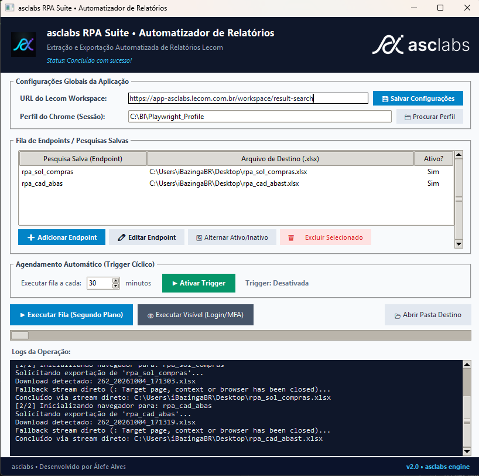

# asclabs RPA Suite • Automatizador de Relatórios

Automação corporativa com Playwright, Tkinter e banco embutido SQLite3 para extração programada de relatórios da plataforma Lecom, suportando múltiplos endpoints, agendamento cíclico (trigger inteligente) com proteção contra queda de sessão e geração de executável autônomo (.exe).

<p align="center">
  
</p>

---

## 📁 Estrutura de Arquivos

| Arquivo | Tipo | Finalidade |
| :--- | :--- | :--- |
| [`app.py`](file:///c:/Projects/lecom_rpa/app.py) | **Painel Gráfico** | Interface gráfica oficial asclabs: gestão de rotinas, parametrização de URLs, trigger com contagem regressiva e monitor de sessão. |
| [`i_rpa_tarefa.py`](file:///c:/Projects/lecom_rpa/i_rpa_tarefa.py) | **Entidade / Contrato** | Classe `TarefaExportacao` com tipagem forte para representação de endpoints e caminhos de arquivo. |
| [`i_rpa_repositorio.py`](file:///c:/Projects/lecom_rpa/i_rpa_repositorio.py) | **Contrato (Interface)** | Interface abstrata para persistência desacoplada de dados e configurações locais. |
| [`rpa_repositorio_sqlite.py`](file:///c:/Projects/lecom_rpa/rpa_repositorio_sqlite.py) | **Repositório SQLite** | Gerencia as tabelas `tarefas` e `configuracoes` no banco embutido local `rpa_dados.db`. |
| [`build.bat`](file:///c:/Projects/lecom_rpa/build.bat) | **Script de Build** | Automação de compilação PyInstaller gerando o executável único `dist\asclabs_AutomatizadorRelatorios.exe`. |
| [`assistido.py`](file:///c:/Projects/lecom_rpa/assistido.py) | **CLI Assistido** (`headless=False`) | Execução sequencial com navegador visível para validação visual e renovação de login SSO/MFA. |
| [`desassistido.py`](file:///c:/Projects/lecom_rpa/desassistido.py) | **CLI Desassistido** (`headless=True`) | Execução sequencial em segundo plano (background) para agendadores do sistema operacional. |
| [`interativo.py`](file:///c:/Projects/lecom_rpa/interativo.py) | **Inspetor** (`page.pause()`) | Abre a sessão e congela no Playwright Inspector para mapeamento e depuração de novos seletores. |

---

## ⚙️ Pré-requisitos (Desenvolvimento)

1. **Python 3.10+** instalado no Windows.
2. **Google Chrome** instalado (o RPA conecta diretamente ao canal oficial `channel="chrome"`).
3. Dependências Python:
   ```bash
   pip install playwright pyinstaller pillow
   playwright install chromium
   ```

---

## 📌 Configurações e Persistência (SQLite)

Todas as configurações e tarefas ficam salvas localmente no banco de dados SQLite (`rpa_dados.db`):
- **URL do Lecom Workspace:** Parametrizável diretamente na interface (permite conectar a qualquer instância ou domínio Lecom).
- **Perfil de Navegação (Chrome Profile):** Diretório onde tokens SSO, cookies e preferências de sessão ficam mantidos.
- **Intervalo da Trigger:** Frequência de repetição cíclica configurável em minutos.
- **Fila de Endpoints (Em branco por padrão):** O aplicativo inicia limpo, permitindo que cada usuário cadastre suas próprias pesquisas salvas e destinos de relatório.

> [!IMPORTANT]
> **Padrão Obrigatório de Nomenclatura das Pesquisas Salvas no Lecom:**
> 1. **Utilize `snake_case`:** Sempre cadastre os identificadores com letras minúsculas e separadas por underline (ex: `rpa_sol_compras`, `rpa_cad_abast`).
> 2. **Limite Reduzido de Caracteres:** Mantenha os nomes curtos e objetivos (máximo recomendado de 15 a 20 caracteres), utilizando abreviações.
> 3. **Prevenção de Falhas no DOM:** Nomes excessivamente longos, com espaços ou acentos sofrem truncamento visual na aba *"Pesquisas salvas"* do Lecom, impedindo que o motor Playwright localize e clique no elemento HTML correspondente na árvore DOM.

---

## 🔄 Ciclo de Execução e Resiliência

1. **Ciclo Isolado por Endpoint:** Cada endpoint é executado em sua própria sessão limpa de navegador, eliminando vazamentos de memória e prevenindo erros de fechamento intencional de janelas pelo Lecom (`TargetClosedError`).
2. **Navegação & SSO:** Acessa a URL parametrizada e valida autenticação corporativa automática (SAML/SSO).
3. **Monitoramento de Sessão:** Caso ocorra redirecionamento para telas de autenticação (`/login` ou `/sso`), dispara `SessionExpiredError`, interrompe a trigger automática e orienta o login pelo modo visível.
4. **Exportação & Download Fallback:**
   - Clica no campo de busca e aciona a pesquisa salva no `tablist`.
   - Aciona o modal de exportação com *"Informações do formulário"*.
   - Captura o download via evento nativo ou fallback por stream HTTP autenticado com cookies da sessão.
5. **Finalização Limpa:** O navegador é sempre fechado ao final do endpoint, mantendo a máquina do usuário livre de processos órfãos.

---

## 🖥️ Como Utilizar a Interface Gráfica / Executável

### 1. Executar via Python:
```bash
python app.py
```

### 2. Gerar o Executável (.exe):
Dê duplo clique em [build.bat](file:///c:/Projects/lecom_rpa/build.bat) ou execute no terminal:
```cmd
build.bat
```
O executável final estará pronto em:
`dist\asclabs_AutomatizadorRelatorios.exe`

### Recursos do Painel:
- **Gerenciador de Endpoints:** Tabela interativa para adicionar novas pesquisas salvas, alternar status ativo/inativo, editar e excluir rotinas.
- **Configurações Gerais:** Campos editáveis para URL do Workspace e pasta do Perfil do Chrome com persistência direta em banco SQLite.
- **Trigger Automática:** Intervalo em minutos configurável com contagem regressiva em tempo real.
- **Segurança e Isolamento de Estado:** Bloqueio preventivo de controles concorrentes enquanto houver rotinas ou triggers em execução ativa.
- **Executar Visível:** Botão para abrir o navegador e realizar login manual com tempo estendido e suporte a MFA corporativo.

---

## 🔒 Conformidade com a LGPD (Lei nº 13.709/2018)

- **Processamento Estritamente Local:** O software opera em regime *on-premises*, sem qualquer telemetria, rastreamento ou transmissão remota de relatórios e metadados.
- **Minimização de Dados:** O banco embutido armazena apenas configurações de rotinas técnicas locais. Não há gravação de senhas, credenciais ou dados pessoais sensíveis.
- **Governança de Acesso:** A autenticação é delegada exclusivamente ao navegador Google Chrome e aos provedores de identidade oficiais da organização.

---

## 🏢 Desenvolvimento & Identidade

- **Startup:** asclabs
- **Play Store / Package ID Padrão:** `br.com.asclabs.lecom_rpa`
- **Responsável Técnico / Desenvolvedor:** Álefe Alves
- **Tecnologias e Padrões:** Clean Architecture, SOLID, Playwright, SQLite3, Tkinter
- **Licença:** [LICENSE.md](file:///c:/Projects/lecom_rpa/LICENSE.md) (MIT License)
